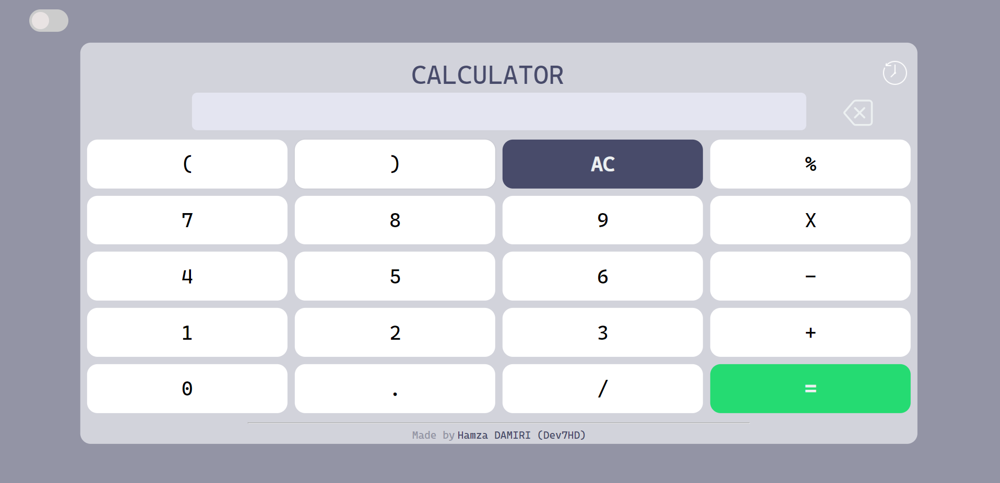
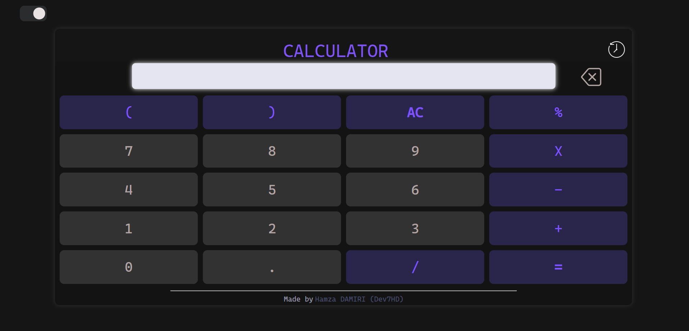
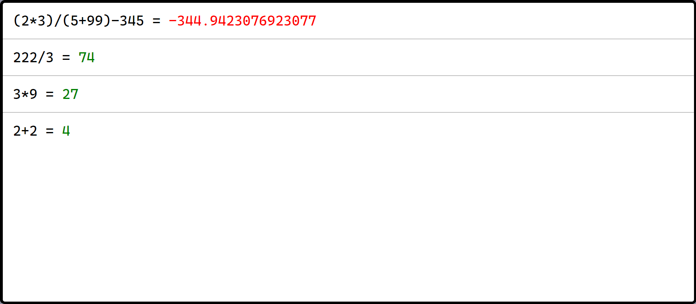

# Calculator Dev7HD 🧮

This is a simple calculator application developed by me using HTML, CSS, and JavaScript.

## Features

- Basic arithmetic operations: addition, subtraction, multiplication, and division
- Parentheses support for complex expressions
- Error handling for invalid inputs
- Dark mode toggle
- Calculation history tracking

## Usage

To use the calculator, simply open the `index.html` file in your browser.

- Click on the buttons to input numbers and perform operations.
- Use the `AC` button to clear all inputs.
- The `=` button evaluates the expression.
- Turn on dark mode using the toggle switch at the top right.
- View calculation history by clicking on the history icon.

## Screenshots

## Try it

**CalculatorJS** - [Click here](https://dev7hd.github.io/JSCalculator/)

## Contributing

This project is open for contributions. Feel free to fork the repository, make changes, and submit pull requests.

## Credits

- **Dev7HD** - [GitHub Profile](https://github.com/Dev7HD)

---

For any issues or suggestions, please open an issue on the [GitHub repository](https://github.com/Dev7HD/calculator).

Happy calculating! 🎉
