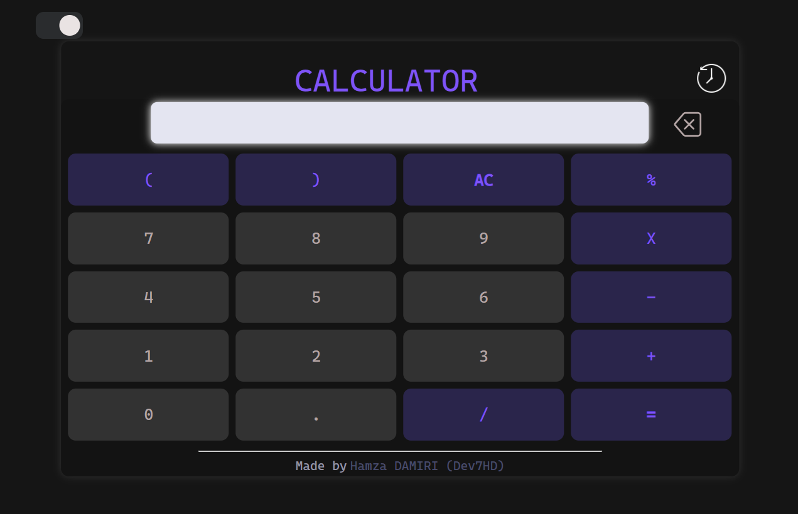

# JavaScript Calculator 🧮

A JavaScript Calculator created by [Dev7HD](https://github.com/Dev7HD).

## Overview 🌐

The Simple JavaScript Calculator is a user-friendly web-based calculator developed using JavaScript. It offers essential arithmetic operations to facilitate quick and efficient calculations.

## Usage 🚀

Access the Simple JavaScript Calculator through the following link: [JavaScript Calculator](https://dev7hd.github.io/JSCalculator/).

Simply input your mathematical expressions and leverage the calculator's features to perform calculations effortlessly.

## Contributors 👥

Contributions are encouraged to enhance and refine this project. If you wish to contribute or address existing issues, feel free to do so. Let's collaborate to further improve this calculator! 🤝
